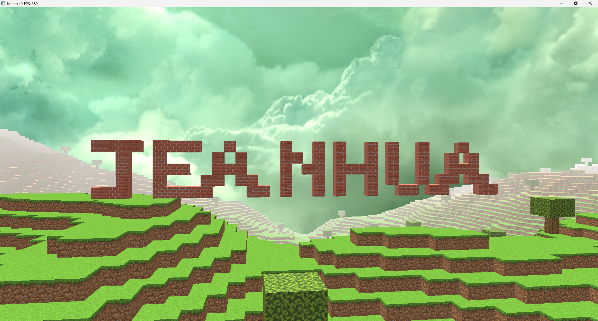
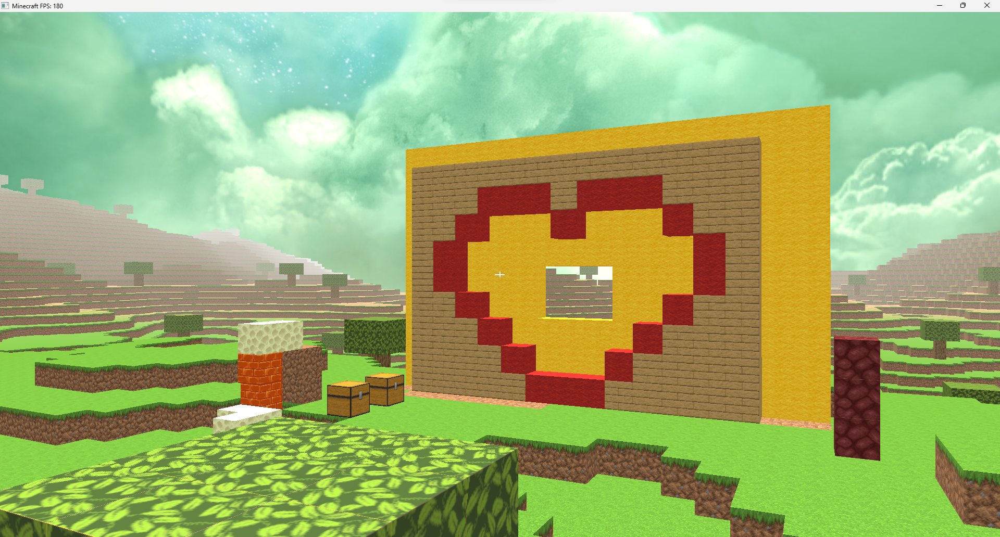
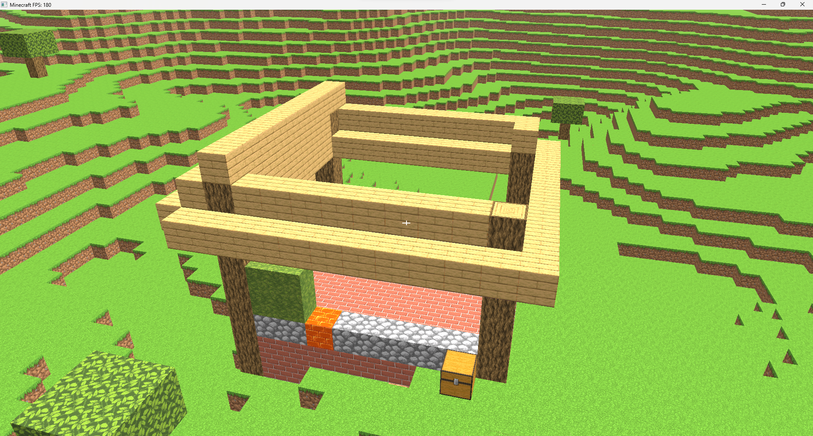

# C++ 手搓简易版Minecraft



## 简介

这是一个使用 OpenGL 从零打造的简易版 Minecraft，实现了基础的沙盒游戏功能。项目包含无限地图生成、动态树木生成、方块放置与破坏等核心玩法。

你可以[点击这里](https://github.com/jeanhua/Minecraft/releases)下载编译好的项目来体验

> 启动参数：
>
> `--rd`: 渲染区块半径，默认20个区块，若性能不足可降低渲染半径
>
> `--ms`: 地图种子，无参数则随机生成
>
> `--ts`: 树木种子，无参数则随机生成
>
> 示例`.\\Minecraft.exe --rd 10 --ms 12345 --ts 12345 `，或者直接双击打开也行( )

---

如果你想要尝试编译项目，请安装如下依赖

- **GLM** - 数学库，用于矩阵和向量运算
- **stb_image** - 轻量级图像加载库
- **Glad** - OpenGL 函数指针加载器
- **GLFW** - 跨平台窗口和上下文管理
- **fastnoise2** - 噪声生成库，用于柏林地形算法
- **imgui** - 跨平台GUI库

将依赖下载好后在代码根目录创建package文件夹，然后创建结构如下

```bash
├─include
├─lib
└─source
```

将对应的依赖放置进去即可，glad没有提供编译的链接，直接把glad.c文件放进source文件夹即可

或者你可以自己修改CMakeLists.txt进行构建编译

## 展示



